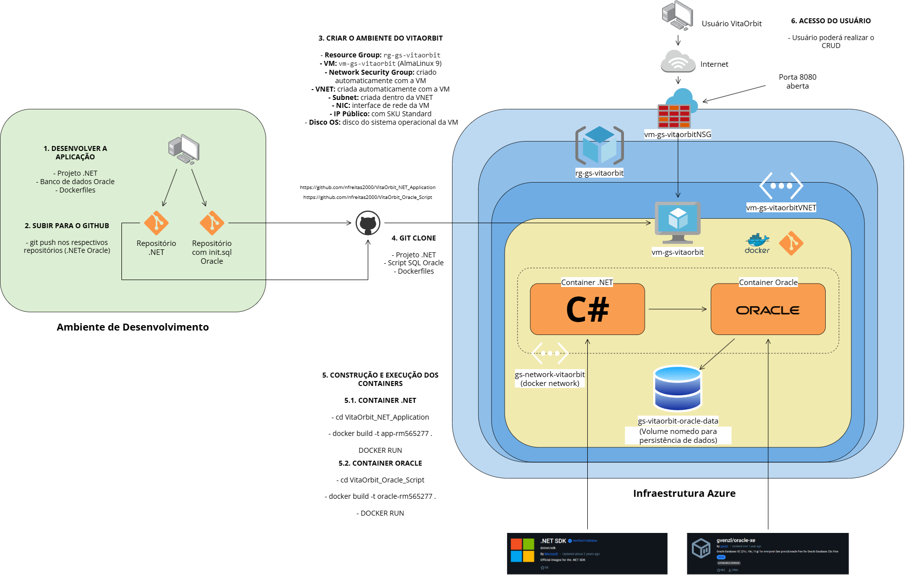

# How To — VitaOrbit DevOps

## Descrição da Solução

O VitaOrbit é uma API REST desenvolvida em .NET para monitoramento de saúde em ambientes extremos. A solução permite o registro e acompanhamento de dados vitais, sintomas, condições ambientais, emergências e alertas de risco para os usuários.

A arquitetura é composta por dois containers Docker integrados em uma rede privada:
- **Container da Aplicação**: API .NET (C#) com CRUD de seis tabelas;
- **Container do Banco de Dados**: Oracle XE com persistência em volume nomeado;

---

## Arquitetura Macro



---

## Instruções de execução

### 1. Clonar os Repositórios

Dentro da máquina que será utilizada, clone os repositórios:

```bash
mkdir gs-vitaorbit
cd gs-vitaorbit

git clone https://github.com/nfreitas2000/VitaOrbit_Oracle_Script.git
git clone https://github.com/nfreitas2000/VitaOrbit_NET_Application.git

ls -l
```

---

### 2. Criar Rede e Volume Docker

Realize a criação de uma rede docker e do volume docker. A rede será utilizada para a comunicação entre o container .NET e o container Oracle, e o volume será utilizado para a persistência de dados.

```bash
docker network create gs-network-vitaorbit
docker network ls

docker volume create gs-vitaorbit-oracle-data
docker volume ls
```

---

### 3. Subir o Container do Banco de Dados (Oracle)

```bash
cd VitaOrbit_Oracle_Script
ls -l
cat Dockerfile

docker build -t oracle-rm565277 .

docker run -d \
  --name oracle-rm565277 \
  --network gs-network-vitaorbit \
  -p 1521:1521 \
  -v gs-vitaorbit-oracle-data:/opt/oracle/oradata \
  oracle-rm565277
```

Acompanhe os logs até aparecer a mensagem `DATABASE IS READY TO USE!`:

```bash
docker logs -f oracle-rm565277
```

Verifique o volume montado:

```bash
docker inspect oracle-rm565277 | grep gs-vitaorbit-oracle-data
```

---

### 4. Subir o Container da Aplicação (.NET)

```bash
cd ../VitaOrbit_NET_Application
ls -l
cat Dockerfile

docker build -t app-rm565277 .

docker run -d \
  --name app-rm565277 \
  --network gs-network-vitaorbit \
  -p 8080:8080 \
  -e ASPNETCORE_ENVIRONMENT=Development \
  -e ConnectionStrings__OracleConnection="User Id=APPUSER;Password=App123;Data Source=oracle-rm565277:1521/XEPDB1;" \
  app-rm565277
```

---

### 5. Verificar os Containers em Execução

```bash
docker ps
```

Ambos os containers devem aparecer com status `Up`.

---

### 6. Exibir Logs dos Containers

```bash
docker logs oracle-rm565277
docker logs app-rm565277
```

---

### 7. Inspecionar os Containers

**Container da Aplicação:**

```bash
docker container exec app-rm565277 whoami
docker container exec app-rm565277 pwd
docker container exec app-rm565277 ls -l
```

**Container do Banco:**

```bash
docker container exec oracle-rm565277 whoami
docker container exec oracle-rm565277 pwd
docker container exec oracle-rm565277 ls -l
```

---

### 8. Testar a API

Com os containers rodando, acesse a API pelo IP público da VM:

```
http://<IP_PUBLICO_VM>:8080/scalar/v1
```

---

### 9. Verificar Persistência no Banco (SELECT)

Conecte-se diretamente no container Oracle:

```bash
docker exec -it oracle-rm565277 sqlplus APPUSER/App123@XEPDB1
```

Execute os SELECTs para evidenciar os dados:

```sql
SELECT * FROM VITA_USERS;
SELECT * FROM VITA_HEALTH_RECORDS;
SELECT * FROM VITA_SYMPTOM_RECORDS;
SELECT * FROM VITA_ENVIRONMENTAL_CONDITIONS;
SELECT * FROM VITA_EMERGENCIES;
SELECT * FROM VITA_ALERTS;
```

---

## Endpoints da API

### User

#### GET — Listar todos os usuários
```
GET /api/User
```

#### GET — Buscar por ID
```
GET /api/User/{id}
```

#### POST — Criar usuário
```
POST /api/User
Content-Type: application/json

{
  "fullName": "Renato Almeida",
  "email": "renato@email.com",
  "password": "123456",
  "birthDate": "2005-03-15T00:00:00Z",
  "gender": "Masculino",
  "userDescription": "Usuário para testes da API",
  "currentLocation": "São Paulo - SP",
  "phoneNumber": "11999999999",
  "emergencyContact": "11888888888"
}
```

#### POST — Login
```
POST /api/User/login
Content-Type: application/json

{
  "email": "natan@vitaorbit.com",
  "password": "senha123"
}
```

#### PUT — Atualizar e-mail
```
PUT /api/User/{id}/email
Content-Type: application/json

{
  "email": "almeira@gmail.com"
}
```

#### PUT — Atualizar telefone
```
PUT /api/User/{id}/phone
Content-Type: application/json

{
  "phoneNumber": "11123456789"
}
```

#### PUT — Atualizar localização
```
PUT /api/User/{id}/location
Content-Type: application/json

{
  "currentLocation": "Espaço"
}
```

#### PUT — Atualizar contato de emergência
```
PUT /api/User/{id}/emergency-contact
Content-Type: application/json

{
  "emergencyContact": "11257849999"
}
```

#### DELETE — Remover usuário
```
DELETE /api/User/{id}
```

---

### HealthRecord

#### GET — Listar todos os registros
```
GET /api/HealthRecord
```

#### GET — Buscar por ID
```
GET /api/HealthRecord/{id}
```

#### GET — Buscar por usuário
```
GET /api/HealthRecord/user/{userId}
```

#### POST — Criar registro de saúde
```
POST /api/HealthRecord
Content-Type: application/json

{
  "userId": 1,
  "heartRate": 78,
  "systolicPressure": 120,
  "diastolicPressure": 80,
  "bodyTemperature": 36.7,
  "oxygenSaturation": 98,
  "hydrationLevel": 85,
  "sleepHours": 7.5,
  "notes": "Paciente sem alterações.",
  "riskClassification": "Baixo"
}
```

#### DELETE — Remover registro
```
DELETE /api/HealthRecord/{id}
```

---

### SymptomRecord

#### GET — Listar todos os sintomas
```
GET /api/SymptomRecord
```

#### GET — Buscar por ID
```
GET /api/SymptomRecord/{id}
```

#### GET — Buscar por usuário
```
GET /api/SymptomRecord/user/{userId}
```

#### POST — Registrar sintoma
```
POST /api/SymptomRecord
Content-Type: application/json

{
  "userId": 1,
  "symptomName": "Dor de cabeça",
  "intensity": 6,
  "frequency": "Diária",
  "description": "Dor moderada no período da tarde",
  "startedAt": "2026-06-07T10:00:00Z",
  "riskClassification": "Médio"
}
```

#### DELETE — Remover sintoma
```
DELETE /api/SymptomRecord/{id}
```

---

### EnvironmentalCondition

#### GET — Listar todas as condições
```
GET /api/EnvironmentalCondition
```

#### GET — Buscar por ID
```
GET /api/EnvironmentalCondition/{id}
```

#### GET — Buscar por usuário
```
GET /api/EnvironmentalCondition/user/{userId}
```

#### POST — Criar condição ambiental
> Remova qualquer condição existente do usuário antes de criar uma nova.

```
POST /api/EnvironmentalCondition
Content-Type: application/json

{
  "userId": 2,
  "externalTemperature": 35.5,
  "humidity": 65.0,
  "altitude": 850.0,
  "atmosphericPressure": 1013.25,
  "airQuality": "Boa",
  "radiationLevel": 0.15,
  "environmentType": "Montanha"
}
```

#### PUT — Atualizar condição ambiental
```
PUT /api/EnvironmentalCondition/{id}
Content-Type: application/json

{
  "userId": 2,
  "externalTemperature": 35.5,
  "humidity": 65.0,
  "altitude": 850.0,
  "atmosphericPressure": 1013.25,
  "airQuality": "Boa",
  "radiationLevel": 0.15,
  "environmentType": "Alpes Polares"
}
```

#### DELETE — Remover condição
```
DELETE /api/EnvironmentalCondition/{id}
```

---

### Emergency

#### GET — Listar todas as emergências
```
GET /api/Emergency
```

#### GET — Buscar por ID
```
GET /api/Emergency/{id}
```

#### GET — Buscar por usuário
```
GET /api/Emergency/user/{userId}
```

#### PUT — Atualizar status
```
PUT /api/Emergency/{id}/status
Content-Type: application/json

"Pendente"
```

#### DELETE — Remover emergência
```
DELETE /api/Emergency/{id}
```

---

### Alert

#### GET — Listar todos os alertas
```
GET /api/Alert
```

#### GET — Buscar por ID
```
GET /api/Alert/{id}
```

#### GET — Buscar por usuário
```
GET /api/Alert/user/{userId}
```

#### POST — Criar alerta
```
POST /api/Alert
Content-Type: application/json

{
  "userId": 1,
  "healthRecordId": 1,
  "typeAlert": "Monitoramento",
  "message": "Paciente dentro dos parâmetros normais",
  "riskLevel": "Baixo",
  "registeredAt": "2026-06-06T20:00:00"
}
```

#### DELETE — Remover alerta
```
DELETE /api/Alert/{id}
```
---

## Equipe

| RM | Nome |
|----|------|
| RM563686 | *Beatriz de Sousa Franco* |
| RM564430 | *Giovana Souza Vieira* |
| RM565277 | *Maria Fernanda Santos Mendes* |
| RM564992 | *Natan Freitas de Moraes* |
